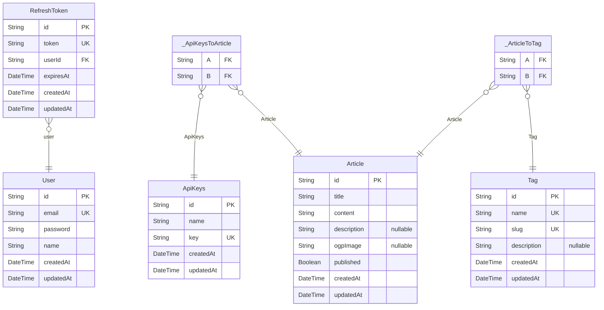

# DB Schema
> Generated by [`prisma-markdown`](https://github.com/samchon/prisma-markdown)

- [default](#default)

## default

### `User`

**Properties**
  - `id`: 
  - `email`: 
  - `password`: 
  - `name`: 
  - `createdAt`: 
  - `updatedAt`: 

### `RefreshToken`

**Properties**
  - `id`: 
  - `token`: 
  - `userId`: 
  - `expiresAt`: 
  - `createdAt`: 
  - `updatedAt`: 

### `ApiKeys`

**Properties**
  - `id`: 
  - `name`: 
  - `key`: 
  - `createdAt`: 
  - `updatedAt`: 

### `Article`

**Properties**
  - `id`: 
  - `title`: 
  - `content`: 
  - `description`: 
  - `ogpImage`: 
  - `published`: 
  - `createdAt`: 
  - `updatedAt`: 

### `Tag`

**Properties**
  - `id`: 
  - `name`: 
  - `slug`: 
  - `description`: 
  - `createdAt`: 
  - `updatedAt`: 

### `_ApiKeysToArticle`
Pair relationship table between [ApiKeys](#ApiKeys) and [Article](#Article)

**Properties**
  - `A`: 
  - `B`: 

### `_ArticleToTag`
Pair relationship table between [Article](#Article) and [Tag](#Tag)

**Properties**
  - `A`: 
  - `B`: 